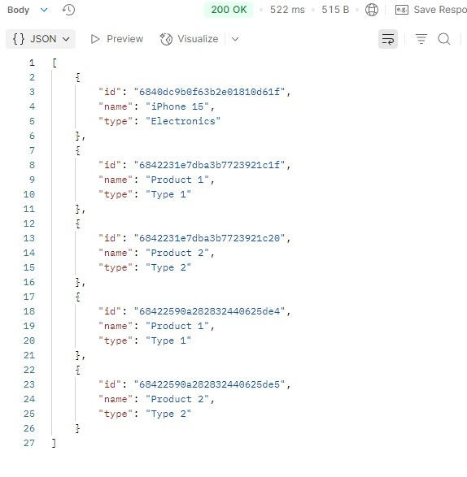
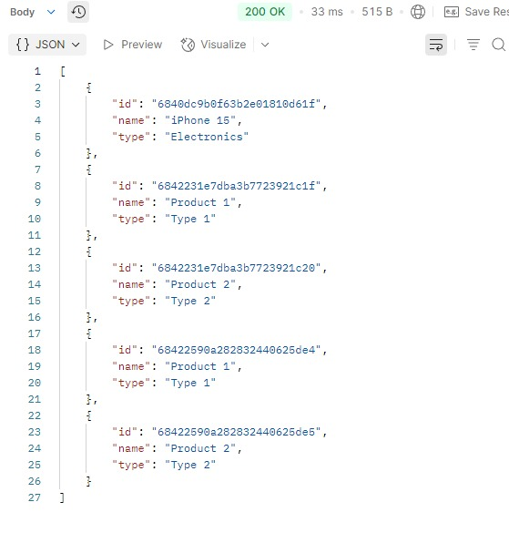

# Market API with Redis Cache

This project demonstrates a Spring Boot application implementing Redis caching with MongoDB as the primary database. It showcases how to implement and test caching strategies in a real-world application.

## 🚀 Features

- CRUD operations for Products
- Redis caching implementation
- MongoDB integration
- Swagger UI documentation
- Integration tests with TestContainers
- Cache performance monitoring

## 🛠️ Technologies

- Java 17
- Spring Boot 3.5.0
- Redis (for caching)
- MongoDB (as primary database)
- Docker (for Redis and MongoDB)
- Swagger UI
- Lombok
- TestContainers

## 📋 Prerequisites

- Java 17 or higher
- Docker
- Maven

## ⚡ Cache Performance Results

### First Call (Database Hit)

*First API call hitting the database: Response time ~522ms*

### Second Call (Cache Hit)

*Second API call using Redis cache: Response time 33ms*

### Performance Comparison
*Demonstrating ~94% improvement in response time with Redis cache*

## 🔧 Setup

1. **Clone the repository:**
 bash git clone [repository-url] cd market-api

2. **Start Redis and MongoDB using Docker:**

bash
# Start Redis
docker run -d --name redis -p 6379:6379 redis
# Start MongoDB
docker run -d --name mongodb
-e MONGO_INITDB_ROOT_USERNAME=admin
-e MONGO_INITDB_ROOT_PASSWORD=password
-p 27017:27017 mongo

3. **Build the application:**
  bash mvn clean install

4. **Run the application:**

## 🎯 API Endpoints

### Products API
- `GET /api/products` - Get all products (cached)
- `GET /api/products/{id}` - Get product by ID (cached)
- `POST /api/products` - Create new product
- `PUT /api/products/{id}` - Update product (updates cache)
- `DELETE /api/products/{id}` - Delete product (evicts cache)

### Cache Monitoring
- Swagger UI: `http://localhost:8080/swagger-ui.html`

## 💾 Cache Configuration

The Redis cache is configured with:
- TTL (Time To Live): 10 minutes
- JSON serialization for cached values
- Custom cache names:
    - `products` - for individual products
    - `allProducts` - for the list of all products

java // Example of cached method @Cacheable(value = "products", key = "#id") public ProductDto findById(String id) { // Method implementation }

## 🧪 Testing Cache Performance

The project includes integration tests that demonstrate cache performance:

1. **First Call (Database Hit):**
java // First call hits the database ProductDto firstCall = productService.findById(id);

2. **Second Call (Cache Hit):**
   java // Second call retrieves from cache ProductDto secondCall = productService.findById(id);

Run the tests:
## 📊 Monitoring Cache Performance

The application includes cache monitoring capabilities:
- Performance comparison between database and cache hits
- Cache hit/miss logs
- Cache statistics endpoints

## 🔮 Best Practices Demonstrated

1. **Cache Annotation Usage:**
    - `@Cacheable` - For retrieving data
    - `@CachePut` - For updating cache
    - `@CacheEvict` - For removing cache entries

2. **Integration Testing:**
    - TestContainers for MongoDB testing
    - Cache performance verification
    - Cache content validation

3. **Error Handling:**
    - Proper cache eviction on errors
    - Fallback mechanisms

## 📚 Learning Objectives

This project helps developers understand:
1. How to implement Redis caching in Spring Boot
2. Cache performance monitoring and testing
3. Integration with MongoDB
4. Best practices for caching strategies

## 🤝 Contributing

Feel free to contribute to this project by:
1. Forking the Project
2. Creating your Feature Branch
3. Committing your Changes
4. Pushing to the Branch
5. Opening a Pull Request

## 📝 License

This project is licensed under the MIT License - see the LICENSE.md file for details